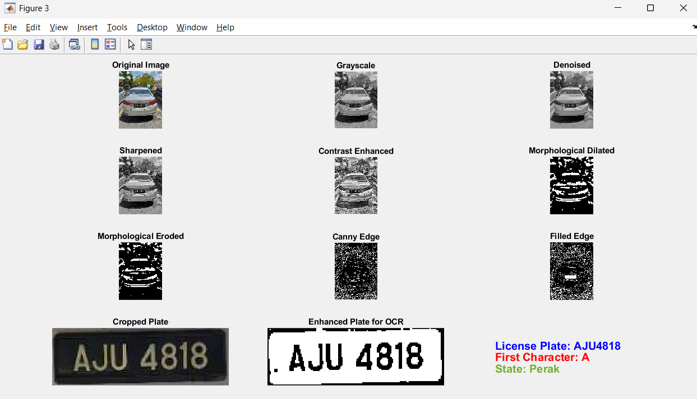
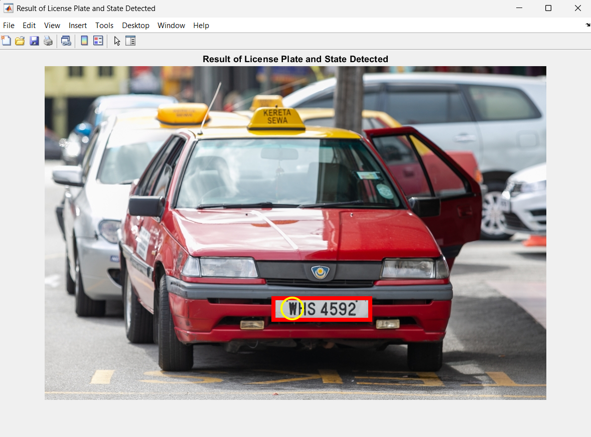
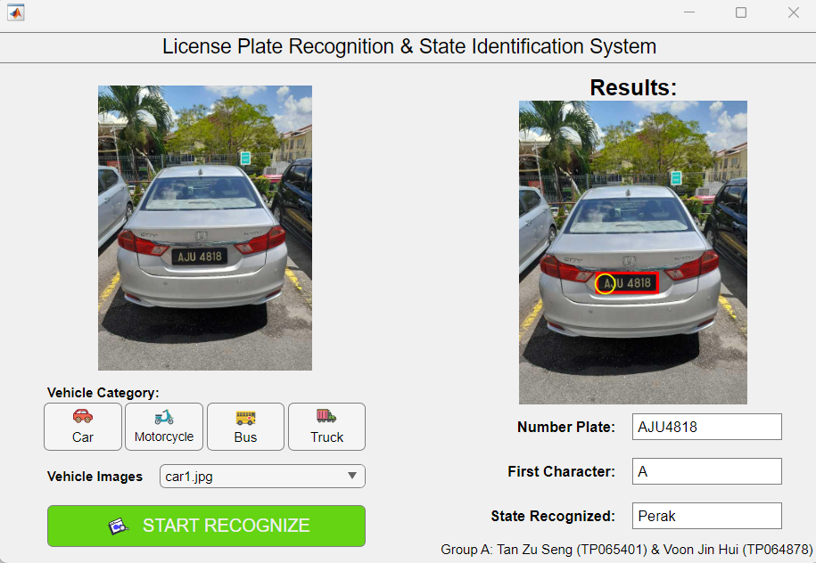
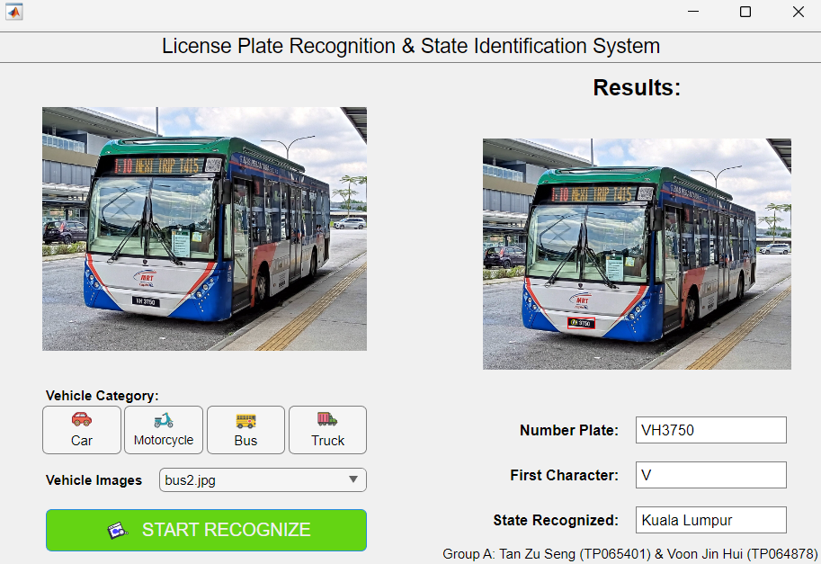
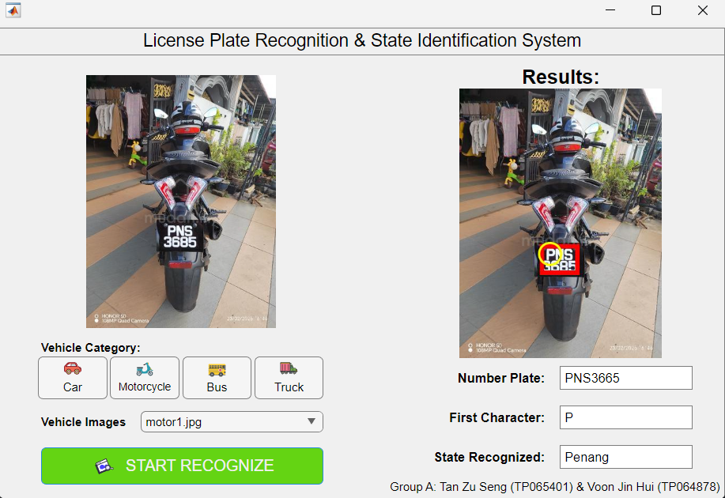
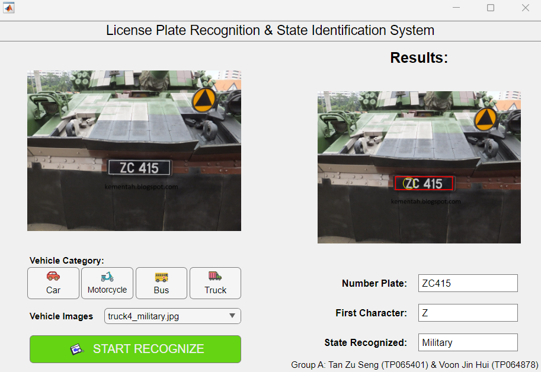

# 🚗 Malaysian License Plate Recognition (LPR) and State Identification System (SIS)

A MATLAB-based system for detecting Malaysian vehicle license plates, extracting text, recognizing plate characters, and identifying the registered state using classical image processing techniques.

---

## 📌 **Project Overview**

This project aims to develop a system that automatically:

1. **Detects** vehicle license plates in images 
2. **Recognizes** alphanumeric characters using OCR
3. **Identifies** the **Malaysian registered state** based on the first character of the license plate  
4. **Visualizes** results with bounding boxes and highlighted state codes  

The system works entirely using **Matlab image processing technqiues**, without machine learning or deep learning models.

---

## 🛠️ **Technology Used**

* **MATLAB** (Image Processing Toolbox)
* Image acquisition from online sources and manual captures
* Tested on various vehicle types:
  **Cars, Motorcycles, Trucks, Buses**
* Tested under various conditions:
  **Angles, lighting differences, outdoor/indoor environments**

---

## 🧰 **Prerequisites**

Before running this project, ensure you have:

<a href="https://www.mathworks.com/downloads/" target="_blank">
  
</a>

**[MATLAB (R2023a or newer recommended)](https://www.mathworks.com/downloads/)**  
Required toolbox: *Image Processing Toolbox*

---

## ⚙️ **Installation & Setup**

1. **Download or clone the repository:**

   ```bash
   git clone https://github.com/jinhui321/Malaysian-License-Plate-Recognition-and-State-Identification-System.git
   ```

2. **Open MATLAB**
   Launch MATLAB on your device.

3. **Open the project folder in MATLAB**

   * Go to **Home → Open → Folder…**
   * Select the downloaded project directory.

4. ✔️ **Repository Structure**

   ```
   📂 Malaysian-License-Plate-Recognition-and-State-Identification-System
   │── README.md
   │── Icon/                     → SVG icons of vehicles
   │── VehicleImages/            → Images of cars, motorcycles, trucks & buses
   │── detectLicensePlate_State.m → Main script (preprocessing, segmentation, OCR, state mapping)
   │── LPR_SIS_Interface.mlapp    → GUI interface for the system
   ```

5. **Run the interface (recommended):**

   * Double-click **LPR_SIS_Interface.mlapp**
   * Click **Run** inside MATLAB App Designer

6. **Or run the processing script directly:**

   ```matlab
   detectLicensePlate_State
   ```

---

# 🔍 **Methodology & Processing Pipeline**

The recognition workflow is divided into **three image-processing levels**.

---

# 1️⃣ **Low-Level Processing – Image Enhancement**

### ✔️ Steps:

1. **Image Acquisition**

   * Images collected manually and online
   * Includes 4 vehicle types under various conditions

  

2. **Preprocessing Steps**

   * **Convert to Grayscale**
     Simplifies image and reduces computation.
   * **Median Filtering (3×3)**
     Removes noise while preserving edges.
   * **Sharpening**
     Improves clarity of characters.
   * **Histogram Equalization**
     Enhances contrast (adaptive histogram equalization).
   * **Binary Thresholding**
     Converts enhanced image to black & white for segmentation.

---

# 2️⃣ **Intermediate-Level Processing – License Plate Segmentation**

### ✔️ Techniques Used:

1. **Morphological Opening**

   * Erosion → Dilation using 5-pixel disk
   * Removes small noise and separates objects.

2. **Morphological Closing**

   * Dilation → Erosion using 2-pixel disk
   * Fills small gaps and smoothens plate region.

3. **Canny Edge Detection + Hole Filling**

   * Extracts strong boundaries
   * Ensures solid regions for plate extraction.

4. **Segmentation of License Plate**

   * Detects the largest connected component
   * Draws a **red bounding box**
   * Crops the plate region for OCR

 
 
---

### 📌 Representation & Description

1. **OCR (Optical Character Recognition)**

   * Restricted alphanumeric set to improve accuracy
   * Extracts characters from the plate

2. **Malaysian State Identification**

   * Map first valid character to a predefined state list
   * Highlights state character with a **yellow circle**

---

# 3️⃣ **High-Level Processing – Character Recognition & State Identification**

The system then:

* Displays the **recognized license plate number**
* Identifies the **Malaysian state** using the extracted first character
* Visualizes results:

  * Red bounding box → License plate region
  * Yellow circle → State identification letter
 
<p align="center">
  
  
</p>

---

# 🧪 **Experimental Results**

### ✔️ Successfully Detected License Plates From:

* Cars
* Motorcycles
* Trucks
* Buses

<p align="center">
  
  
  <br>
  
  
</p>

### ✔️ Successfully Recognized Special Plate Formats:

* Military plates
* Taxi plates
* Two-row plates
* Special series
* Diplomatic series
* Electric Vehicle (EV) plates

Since no machine learning model is trained, **no accuracy metric** is provided — performance is based on deterministic image processing rules.

---

# 📉 **System Performance & Limitations**

### ✔️ Works Well When:

* Lighting is good
* Angle is moderate
* Plate has clear characters
* Image quality is decent

## ❌ Weakness 1: Incorrect Plate Cropping Under Strong Lighting

* System assumes the **largest detected region** is the license plate
* Strong reflections (e.g., truck windshield glare) may cause incorrect cropping

## ❌ Weakness 2: OCR Fails on Low-Quality or Stylized Text

Even when the plate is cropped correctly:

* Fixed threshold & morphology cannot adapt to large lighting variations
* OCR struggles with:

  * Small text
  * Blurry images
  * Fancy or faded fonts
  * Low-resolution taxi plates (motion blur)

---

# 🚀 **Future Improvements**

To improve robustness and accuracy, consider:

* Adaptive thresholding or edge detection techniques instead of fixed threshold
* Machine learning–based license plate detection (YOLO, SSD, etc.)
* Deep learning OCR models (Tesseract LSTM, CRNN)
* Support for rotated or skewed plates
* Dynamic preprocessing based on lighting estimation
* Usage of morphological profiles for multi-row plates

---

# ✨ **Conclusion**

This project demonstrates that traditional MATLAB image processing can effectively detect and recognize Malaysian vehicle license plates under normal conditions. Although limitations appear under harsh lighting and low image quality, the system provides a strong foundation for improvements using adaptive or deep learning techniques.

---

## 🧾 Acknowledgements

I would like to thank my lecturer, for the guidance and support throughout this project.  
Special thanks to my teammate for the cooperation and contributions.

---
